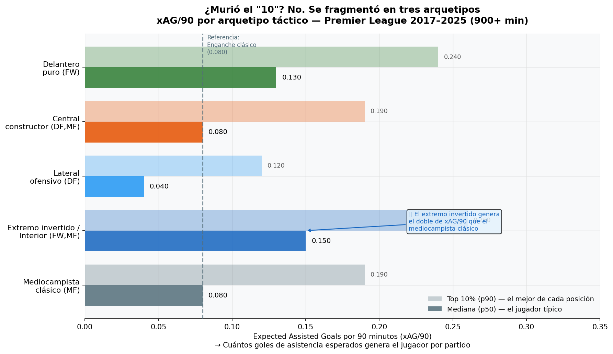
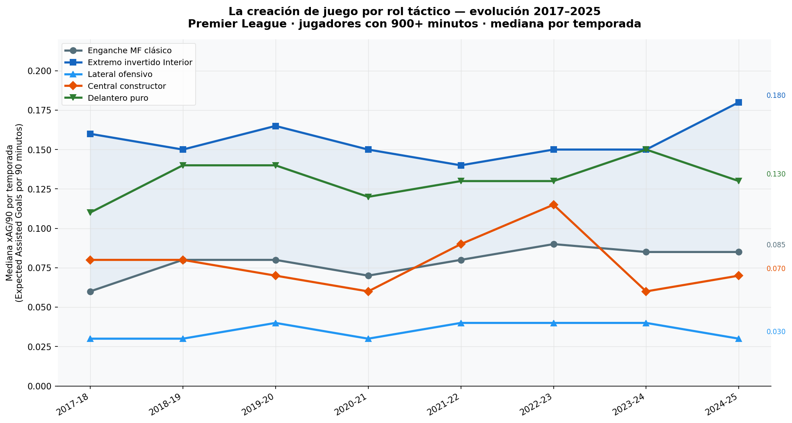
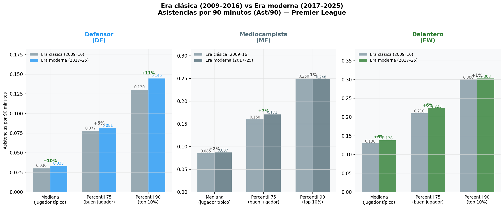
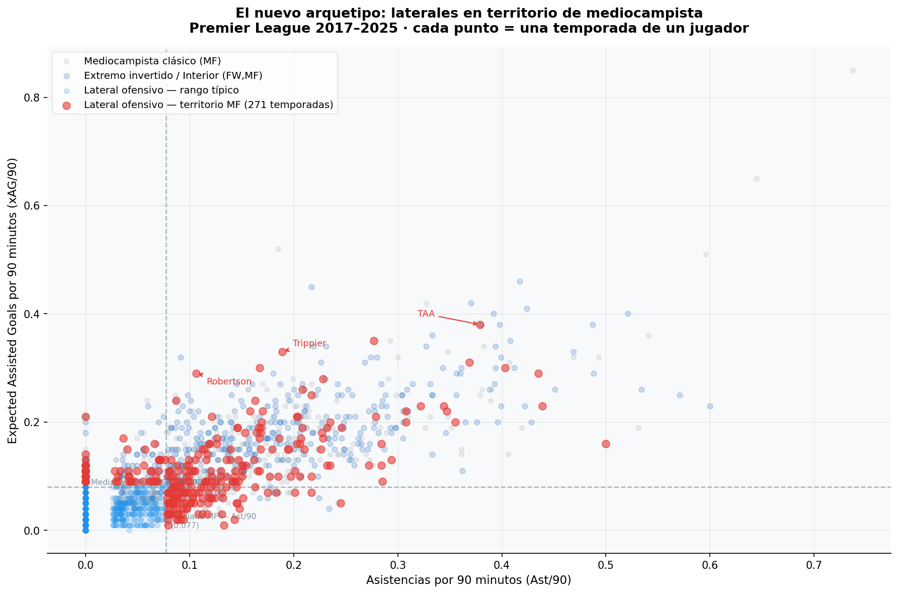
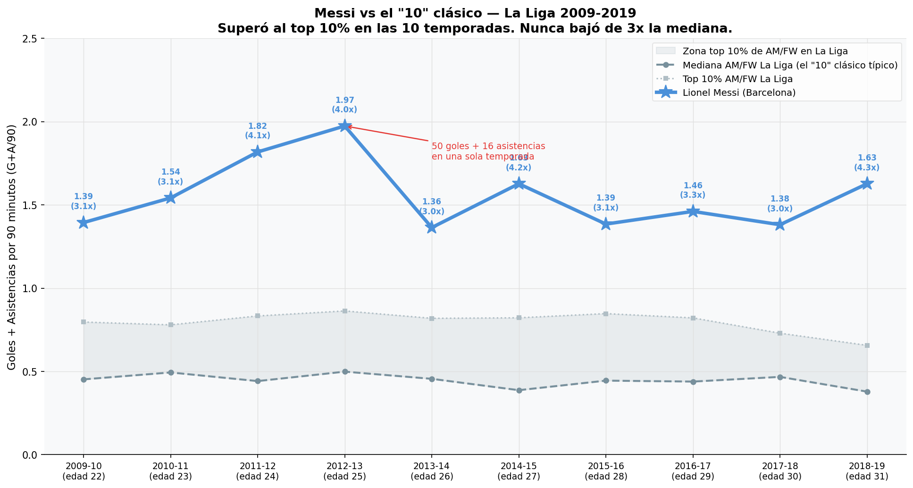
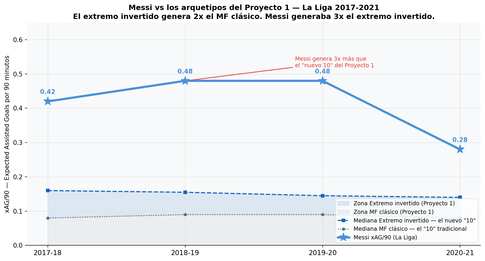
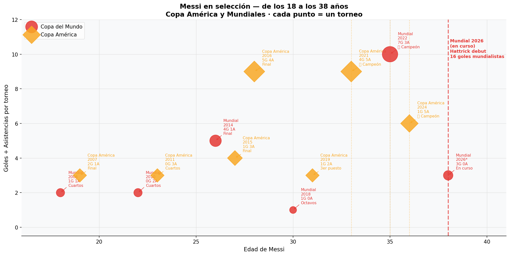
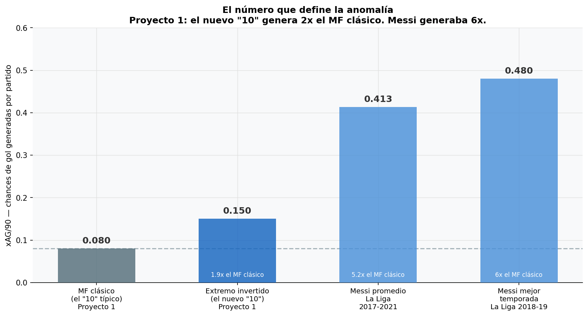

# ⚽ Sports Analytics Portfolio — Tobias Castro

[](https://www.linkedin.com/in/tobias-castro-6a79a0140/)
[](https://www.python.org/)
[](https://fbref.com)

> *Proyectos de Sports Analytics que combinan método con narrativa clara. Cada análisis está conectado con el anterior — construyendo un argumento sobre cómo evolucionó el fútbol moderno.*

---

## 📋 Proyectos

| # | Proyecto | Pregunta central | Stack |
|---|---|---|---|
| 01 | [¿Qué pasó con el jugador más importante?](#proyecto-1) | ¿Se fragmentó el rol del "10" clásico? | Python · pandas · matplotlib |
| 02 | [La anomalía que los datos no explican](#proyecto-2) | ¿Cómo se explica Messi con datos? | Python · pandas · matplotlib |

---

<a name="proyecto-1"></a>
## 🔵 Proyecto 1 — ¿Qué pasó con el jugador más importante de la cancha?
### La evolución táctica del fútbol moderno contada con datos · Premier League 2009–2025

**Autor:** Tobias Castro — Business Intelligence & Analytics Consultant  
**LinkedIn:** [Tobias Castro](https://www.linkedin.com/in/tobias-castro-6a79a0140/)  
**Stack:** Python · pandas · matplotlib · numpy  
**Datos:** FBref vía Kaggle · Premier League 2009–2025

---

## La pregunta

El "10" clásico — el enganche que recibe, gira y da el pase de ruptura — ¿sigue siendo el eje creador del fútbol moderno?

---

## El contexto táctico

El Barça de Guardiola (2008–2012) dominó Europa con un mediocampista ofensivo en el centro de todo. Pero ese sistema requería algo que el fútbol moderno ya no da: **tiempo en la pelota**.

Klopp sistematizó y popularizó el Gegenpressing en Europa con el Dortmund — presionar al rival inmediatamente tras perder la pelota. Ese sistema redujo el tiempo de decisión de 3–4 segundos a menos de 1. El espacio entre líneas desapareció. Y el enganche estático quedó expuesto.

Pero la creatividad no desapareció con él.

---

## Los 4 hallazgos

| Arquetipo | Posición FBref | xAG/90 mediana | vs enganche clásico |
|---|---|---|---|
| Enganche / MF clásico | MF | 0.080 | referencia |
| Extremo invertido / Interior | FW,MF | 0.150 | **+88%** |
| Lateral ofensivo | DF | 0.040 (mediana) · 0.38 (techo TAA) | nuevo arquetipo |
| Central constructor | DF,MF | 0.080 | igual al "10" desde atrás |

> **xAG/90:** goles de asistencia esperados por cada 90 minutos jugados. Mide la calidad de los pases que generaron chances reales, independientemente de si el delantero convirtió.

---

## Visualizaciones

### 1 — El insight central: los arquetipos tácticos


### 2 — Evolución temporal 2017–2025


### 3 — Era clásica vs Era moderna


### 4 — El nuevo arquetipo: laterales en territorio de mediocampista


---

## Estructura del repo

```
tactical-evolution-premier-league/
│
├── notebooks/
│   ├── 01_EDA_PL_202425.py           → Exploración del dataset moderno
│   └── 02_analisis_comparativo.py    → Análisis principal con los 4 hallazgos
│
├── visualizaciones/
│   ├── viz1_arquetipos_tacticos.png
│   ├── viz2_evolucion_temporal.png
│   ├── viz3_comparacion_eras.png
│   └── viz4_scatter_nuevo_arquetipo.png
│
└── README.md
```

---

## Datasets

Los datasets no están incluidos en el repo por tamaño y licencia.
Descargalos directamente desde Kaggle antes de ejecutar los notebooks:

| Dataset | Temporadas | Uso en el análisis | Link |
|---|---|---|---|
| Standard Stats histórico | 2000–2023 · múltiples ligas | Era clásica — Ast/90 por posición | [Kaggle](https://www.kaggle.com/datasets/beridzeg45/top-league-footballer-stats-2000-2023-seasons) |
| Top 5 Ligas Europeas 2017–2025 | 2017–2025 · 5 ligas | Era moderna — xAG/90 y arquetipos | [Kaggle](https://www.kaggle.com/datasets/emrey3lmaz/top-5-league-football-player-stats-2017-2025) |
| FBref PL 2024-25 | 2024–25 · Premier League | Dataset moderno de referencia | [Kaggle](https://www.kaggle.com/datasets/siddhrajthakor/fbref-premier-league-202425-player-stats-dataset) |

Una vez descargados, colocalos en la misma carpeta donde ejecutás los notebooks (o en la raíz del proyecto si usás Colab).

---

## Cómo ejecutar

```bash
pip install pandas numpy matplotlib
```

Ejecutar en orden desde la carpeta `notebooks/`:

```
01_EDA_PL_202425.py           → exploración inicial
02_analisis_comparativo.py    → análisis completo + genera las 4 visualizaciones
```

---

## Nota metodológica

El xAG (Expected Assisted Goals) no existía como métrica antes de la temporada 2017–18. Para el período 2009–2016 se utiliza **Ast/90** (asistencias por 90 minutos) como proxy histórico. Esta limitación está documentada en cada visualización del análisis.

El filtro de calidad aplicado en ambos datasets es **900 minutos mínimos por temporada** (~10 partidos completos), para evitar que muestras pequeñas distorsionen los promedios.

---

## Glosario

| Métrica | Definición simple |
|---|---|
| xAG/90 | Goles de asistencia esperados por 90 minutos. Mide calidad de pases que generaron chances, no solo las que terminaron en gol. |
| Ast/90 | Asistencias reales por 90 minutos. Proxy histórico para 2009–2016. |
| PrgP/90 | Pases progresivos por 90 minutos. Pases que avanzan la pelota 10+ metros hacia el arco rival. |
| p50 / p90 | Percentil 50 (jugador típico) y percentil 90 (top 10% de su posición). |

---

## Conclusión

El fútbol moderno no eliminó al creador. Lo distribuyó en todo el campo.

El extremo invertido genera el doble de xAG/90 que el enganche clásico. El lateral ofensivo de élite llega a triplicarlo. Y el central constructor opera desde atrás con los mismos números que el "10" de hace 15 años.

> *"El '10' se fragmentó en tres arquetipos distintos."*

---

<a name="proyecto-2"></a>
## 🌟 Proyecto 2 — La anomalía que los datos no pueden explicar
### Messi con datos · La Liga 2009-2019 + Selección Argentina 2006-2026

**Autor:** Tobias Castro — Business Intelligence & Analytics Consultant  
**LinkedIn:** [Tobias Castro](https://www.linkedin.com/in/tobias-castro-6a79a0140/)  
**Stack:** Python · pandas · matplotlib · numpy  
**Datos:** FBref vía Kaggle · La Liga 2009–2019 · FIFA · CONMEBOL

---

## La pregunta

¿Cómo se explica con datos que Messi haga un hattrick en un Mundial a los 38 años?

---

## La conexión con el Proyecto 1

El Proyecto 1 mostró que el pressing moderno redujo el tiempo de decisión a menos de 1 segundo y fragmentó el rol del enganche clásico en tres arquetipos distintos.

Este proyecto analiza al único jugador que desafió esa lógica durante 20 años.

**Respuesta:** No se explica. Los datos solo confirman la magnitud de la anomalía.

---

## Los 4 hallazgos

| Métrica | Dato | Contexto |
|---|---|---|
| G+A/90 promedio La Liga | **1.557** | 3.5x la mediana del resto de AM/FW |
| Temporadas sobre el p90 | **10 de 10** | Nunca bajó del top 10% en La Liga |
| xAG/90 pico (2018-19) | **0.480** | 3x el extremo invertido del Proyecto 1 |
| xAG/90 promedio (2017-21) | **0.413** | 6x el MF clásico típico |
| Copa América | **14G + 17A** en 7 torneos | Máximo asistidor histórico CONMEBOL |
| Mundiales | **16 goles** en 6 mundiales* | Máximo goleador histórico FIFA |

*incluyendo Mundial 2026 en curso

> **G+A/90:** goles más asistencias por 90 minutos. Métrica de producción ofensiva total comparable entre temporadas y ligas.

---

## Visualizaciones

### 1 — Messi vs la mediana del "10" clásico — La Liga 2009-2019


### 2 — Messi vs los arquetipos del Proyecto 1 — xAG/90


### 3 — Carrera en selección — de los 18 a los 38 años


### 4 — El número que define la anomalía


---

## Estructura del repo

```
tactical-evolution-premier-league/
│
├── notebooks/
│   └── 03_proyecto_messi.py         → Análisis completo Proyecto 2
│
├── visualizaciones/
│   ├── messi_viz1_laliga.png
│   ├── messi_viz2_xag_proyecto1.png
│   ├── messi_viz3_seleccion.png
│   └── messi_viz4_el_numero.png
│
└── README.md
```

---

## Datasets

Los datasets no están incluidos en el repo por tamaño y licencia.
Descargalos directamente desde Kaggle antes de ejecutar los notebooks:

| Dataset | Temporadas | Uso en el análisis | Link |
|---|---|---|---|
| LaLiga Summary (x10 archivos) | 2009–2019 | G+A/90 Messi vs pares en La Liga | [Kaggle](https://www.kaggle.com/datasets/thesiff/laliga-stats-2009-to-2019) |
| Top 5 Ligas Europeas | 2017–2021 | xAG/90 — solo temporadas en Barcelona | [Kaggle](https://www.kaggle.com/datasets/emrey3lmaz/top-5-league-football-player-stats-2017-2025) |
| Selección Argentina | 2006–2026 | Datos oficiales por torneo | [FIFA.com](https://www.fifa.com) · [CONMEBOL.com](https://www.conmebol.com) |

---

## Cómo ejecutar

```bash
pip install pandas numpy matplotlib
```

Ejecutar desde la carpeta `notebooks/`:

```
03_proyecto_messi.py    → análisis completo + genera las 4 visualizaciones
```

---

## Nota metodológica

- **PSG excluido:** el dataset solo captura goles de liga — Champions y Supercopa no están incluidos → datos incompletos para una comparación justa
- **MLS excluida:** Inter Miami no está en las 5 grandes ligas europeas — no comparable con el benchmark histórico
- **Selección:** datos de torneos cerrados con estadísticas oficiales de FIFA y CONMEBOL — comparables entre sí

El filtro de calidad aplicado es **900 minutos mínimos por temporada** en los datasets de liga.

---

## Glosario

| Métrica | Definición simple |
|---|---|
| G+A/90 | Goles más asistencias por 90 minutos. Métrica de producción ofensiva total. |
| xAG/90 | Goles de asistencia esperados por 90 minutos. Mide calidad de pases que generaron chances, no solo las que terminaron en gol. |
| Ast/90 | Asistencias reales por 90 minutos. Proxy histórico para períodos sin xAG. |
| p50 / p90 | Percentil 50 (jugador típico) y percentil 90 (top 10% de su posición). |

---

## Conclusión

El Proyecto 1 mostró que el pressing moderno mató al enganche estático.

Messi jugó 20 años en ese mismo fútbol. Nunca bajó del top 10% de La Liga. Generaba 6 veces más chances de gol que el mediocampista clásico típico.

> *"Los datos no explican a Messi. Solo confirman que es una anomalía."*

---

*Tobias Castro · [LinkedIn](https://www.linkedin.com/in/tobias-castro-6a79a0140/) · tobiascastro9813@gmail.com*
